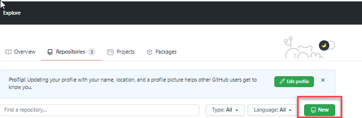
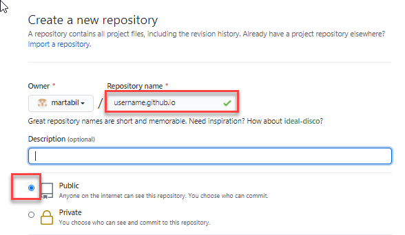
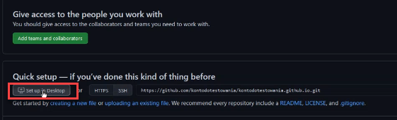
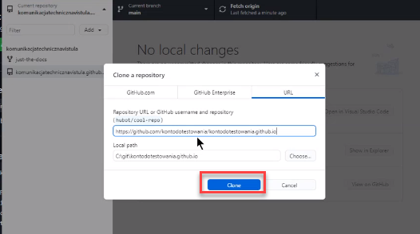
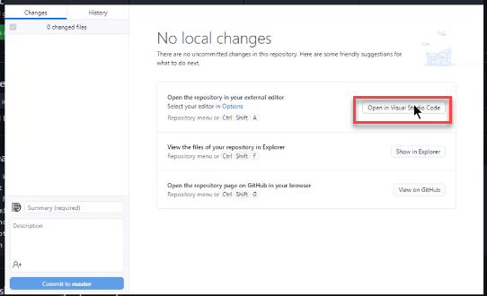
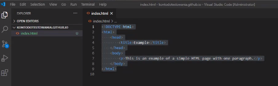
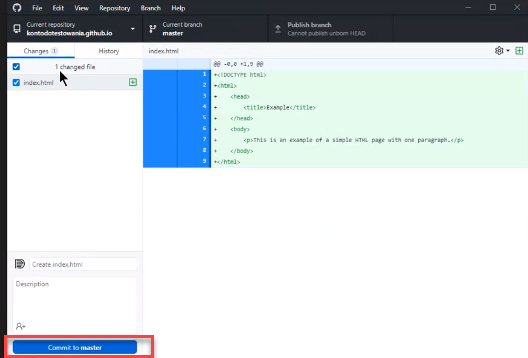
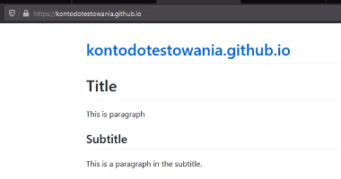

---

layout: default

title: Homework-GitHub Pages

parent: Homework-GitHub Pages

nav_order: 1

---

**What are GitHub Pages**

**GitHub Pages** are public webpages hosted and easily published through GitHub. The quickest way to get up and running is by using the Jekyll Theme Chooser to load a pre-made theme. You can then modify your GitHub Pages’ content and style remotely via the web or locally on your computer.

**Quick user giude**
===

## How to create a website with GitHub Pages

1. Create a new repository
2. From your main profile page click **New** 

3. Give your repository special name username.github.io (where “username” is your actual GitHub user name)
   
    
4. Select **Public**
5. Click **Create repostitory**
6. Click **Set up in Desktop**

7. Clone repostitory 

8. Open in Visual Studio Code

9. In the  folder create new file and name it **Index.html**. Find in the browser beginning of a code Hello World HTML and paste it into the file
 
10. Go to GitHub Desktop and click **Commit to master**

11. Click **Publish branch** 

## How to add markdown file 
1. Change the name of the file for Index.md 
2. Repeat steps 10-11 
3. If you copy address username.github.io (where "username" is your actual Github user name) and paste it to a browser, the final result should be as per below: 
