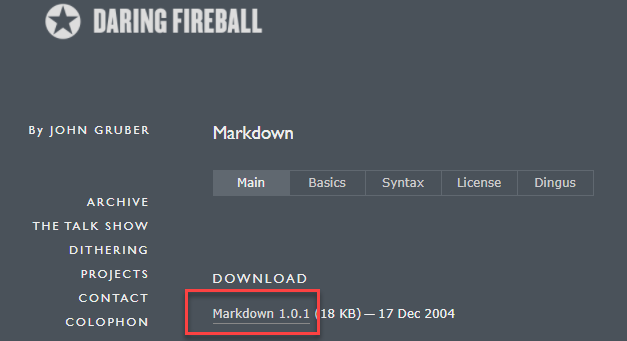
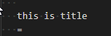
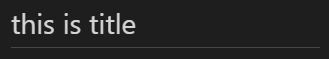
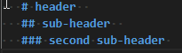
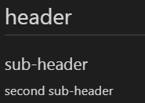
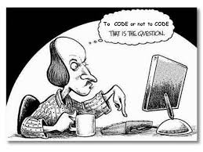

---

layout: default

title: Homework-Markdown

nav_order: 3

---

 
 
 **What is Markdown?**

 **Markdown** is a text-to-HTML conversion tool for web writers. Markdown allows you to write using an easy-to-read, easy-to-write plain text format, then convert it to structurally valid XHTML (or HTML).
 
 Follow the link [download markdown](https://daringfireball.net/projects/markdown/) and click on Markdown 1.0.1 to download the tool.

 

Tip: To see preview on the right save file as markdown. Click Ctrl+Shift+S then choose the location on your computer and extension: markdown. After that click Ctrl+K V 

**Quick user guide**
=====
Table of contents
- [**Quick user guide**](#quick-user-guide)
  - [General](#general)
  - [Emphasis](#emphasis)
  - [Title and headers](#title-and-headers)
  - [Quote](#quote)
  - [Lists](#lists)
  - [Inline code](#inline-code)
  - [Tables](#tables)
  - [Image, link and reference](#image-link-and-reference)
## General

1. To open new document go to File > New File

2. To start a new line make double space or put \ at the end
   
## Emphasis

1. To write in italics use asterisks at the beginning and end of word/phrase *text in italics*
2. To write in bold use double astrisks **text in bold**
   
## Title and headers  

1. To insert title use = under the word/phrase.  
   

   Final result:  
   

 
2. To make a header use # and a space. 
You can use from 1-6 #, each # making the header smaller.  

   Final result:

   

## Quote  
1. To crate a quote start line with >  
   > All the world’s a stage, and all the men and women merely players. They have their exits and their entrances; And one man in his time plays many parts.’ (W.Shakespeare, *As You Like It*, Act 2, Scene 7)

## Lists
1. To create bullet list use * and a space  
   * strawberries
   * cherries
   * blueberries
  
2.  To create numbered list use number followed by . and a space  
       1. cucumber
       2. artichoke
       3. zuccini

## Inline code
1.  To insert inline code use backticks at the beginning and end as in example below 
`P=2ab`

## Tables
1. To create basic tables use | to separate headers of distinct columns and then use -|- to separate content into another verse
  
   first column | second column
   -|-
   first verse | second verse
2. To insert table of contents use square brackets [text to display] and then parentheses with hash before linked text (#linked text)
    
    [header](#header)

    [subheader](#sub-header)

    [second sub-header](#second-sub-header)
## Image, link and reference

1.  To insert an image use ![this text will be visible if no image] (path to the file with image)

2. To insert a link use square brackets [link text] and then parentheses (URLadrres), no spaces between them
   
      [markdown crash course](https://www.youtube.com/watch?v=HUBNt18RFbo)

3. To insert link to another file use square brackets [reference text] (reference link)

      [reference](reference.md)

